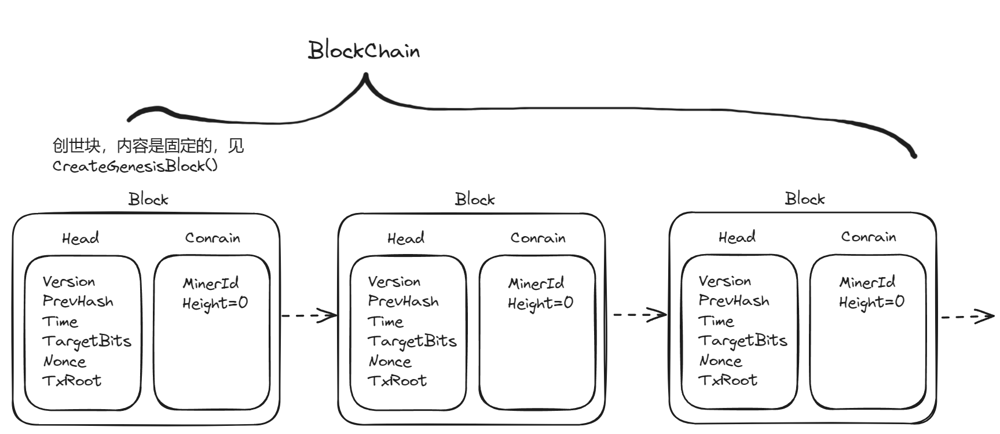
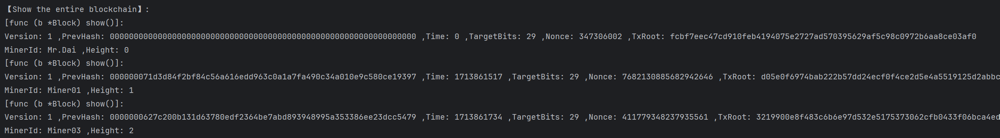

# 工作量证明的区块链原型系统

[TOC]

### 一、数据结构



`block.go`

随机数位数设置：<u>发现4字节的随机数很容易穷尽。</u>

由上述实验得知，每秒约进行$8*10^6$次哈希计算。4字节的随机数（$10^9$数量级）很容易重复（节点间）或是穷尽。我认为，选用4字节是中本聪适应06-10年代算力的设置，因此在实验中，<u>nonce使用8字节</u>。

```
【Prompt】:
nonce字段只有4字节，很容易穷尽。如何解决

【Feedback】:
在比特币区块链中，nonce字段用于挖矿，即寻找一个随机数（Nonce）参与哈希运算，使得最后得到的哈希值符合难度要求。然而，nonce字段只有4字节，搜索空间有限，容易被穷尽。以下是一些解决方案：

时间戳和额外的Nonce：
在比特币的早期阶段，挖矿者可以通过迭代nonce直到得到的哈希值低于目标值来找到一个区块。随着难度的增加，挖矿者经常会循环遍历所有40亿个nonce值，但仍然找不到一个区块。这个问题很容易通过更新区块时间戳以考虑经过的时间来解决。因为时间戳是区块头的一部分，改变时间戳会允许挖矿者再次迭代nonce值，从而产生不同的结果。但一旦挖矿硬件超过4GH/s，这种方法就变得越来越困难，因为nonce值在不到一秒钟的时间内就会被耗尽。

使用coinbase交易作为额外Nonce值的来源：
挖矿者开始使用coinbase交易中的空间作为额外的nonce空间，从而使他们能够探索更大范围的区块头值以找到有效的区块。coinbase交易包含在默克尔树中，这意味着coinbase脚本的任何更改都会导致默克尔根的变化。8字节的额外nonce加上4字节的“标准”nonce，使得挖矿者每秒可以探索总共2^96（8后跟28个零）种可能性，而无需修改时间戳。

利用区块头版本位字段的最多16位用于挖矿：
每台挖矿设备都有自己的coinbase交易，通过仅对区块头进行更改，这使得个别挖矿设备可以达到高达281 TH/s的哈希速率。这比每40亿个哈希值增加一次coinbase交易中的额外nonce更简单，后者需要重新计算默克尔树的整个左侧直到根节点。总之，这些解决方案可以帮助挖矿者在有限的nonce空间内找到有效的区块，同时保持比特币网络的去中心化和安全性。1
```

```go
// BlockHead 区块头，用于哈希计算与验证
type BlockHead struct {
	Version    int32  // 版本号，4个字节，由配置文件指定
	PrevHash   string // 上一个区块的Hash值，哈希值是32个字节，encode为string时为64字节
	Time       int32  // 时间戳，4个字节
	TargetBits int32  // 难度值，4个字节，表示左移的位数
	Nonce      int64  // 随机数，8个字节
	TxRoot     string // 交易根哈希，64个字节，BlockContain的Hash，模拟交易
}

// BlockContain 区块内容，用于存储具体交易信息
type BlockContain struct {
	MinerId string // 矿工 ID，由配置文件指定
	Height  uint   // 区块高度，由上一个区块的BlockContain.Height+1得到
}

// Block 区块
type Block struct {
	Head    BlockHead
	Contain BlockContain
}
```

`blockChain.go`

```go
// Blockchain 参考POW共识协议内容，节点间传输整个区块信息
type BlockChain struct {
	Blocks []*Block
}
```

与结构体有关的函数：

`type BlockHead struct`

```go
// 获得区块头的哈希值，Byte格式，用于获取前一个块头的哈希值(作为key存储)
func (bh *BlockHead) getHashByte() []byte {}
// 获得区块头的哈希值，String格式，用于获取前一个块头的哈希值(块内存储)
func (bh *BlockHead) getHashString() string {}
// 获得区块头的哈希值，Big.Int格式，用于进行比较(工作量证明中进行比较)
func (bh *BlockHead) getHashInt() big.Int {}

// 序列化区块头，用于哈希值计算
func (bh *BlockHead) serialize() []byte {}

// 获得32位时间戳，每次区块链更新之后，更新一次就可以
func (bh *BlockHead) getTime() {}
// 获得32位随机数，每次区块链更新之后，更新一次就可以，随后每次挖矿时nonce = nonce + 1
func (bh *BlockHead) getNonce() {}
```

`type Block struct` 

 

```go
// 初始化区块，仍需补充PrevHash、TxRoot、Height信息
func (b *Block) init() {}

// CreateGenesisBlock 创世块生成函数，注意：不同节点拥有同样的创世块
func CreateGenesisBlock(data string) *Block {}

// 每次计算哈希值后，更新 Nonce
func (b *Block) update() {}

// 得到 BlockContain 后，计算 TxRoot 的哈希值
func (b *Block) getTxRoot() string {}

// show 函数，用于展示区块信息 
func (b *Block) show() {}
```

`type BlockChain struct`

 

```go
// NewBlock 生成新区块
func (bc *BlockChain) NewBlock() (b *Block) {}

// AddPrevMessage 补充新区块的内容:PrevHash、TxRoot、Height
func (bc *BlockChain) AddPrevMessage(newBlock *Block) {}

// AddNewBlock 添加新区块
func (bc *BlockChain) AddNewBlock(newBlock *Block) {}

// Validate 区块链的验证
func (bc *BlockChain) Validate() bool {}
    
// Show 显示区块链信息
func (bc *BlockChain) Show() {}

// 区块链整体的序列化与反序列化
// Serialize 使用方法：blockchainJSON := Blockchain.Serialize()
func (bc *BlockChain) Serialize() []byte {
// Deserialize 使用方法：Blockchain2 := new(BlockChain), Blockchain2.Deserialize(blockchainJSON)
func (bc *BlockChain) Deserialize(blockchainJSON []byte) {}
```


### 二、持久化手段_BoltDB

Bolt 是一个纯键值存储的 Go 数据库，启发自 Howard Chu 的 LMDB. 它旨在为那些无须一个像 Postgres 和 MySQL 这样有着完整数据库服务器的项目，提供一个简单，快速和可靠的数据库。由于 Bolt 意在用于提供一些底层功能，简洁便成为其关键所在。它的 API 并不多，并且仅关注值的获取和设置。仅此而已。https://github.com/boltdb/bolt

```go
const dbFile = "blockchain.db"
const blocksBucket = "blocks"
```

将内存中的区块链保存到本地数据库中：

区块链更新后，每次使用覆盖的方式，将区块链中的区块逐一写入`blocksBucket`中。

 

```go
// SaveBlockchain 将内存中的区块链保存到本地数据库中
func (bc *BlockChain) SaveBlockchain() {}
/*
	key:   当前区块的Time时间戳（使用json格式转化为[]byte）
	value: 当前区块（使用json格式转化为[]byte）
*/
```

读取本地数据库中的区块链到内存中：

使用时间戳，保证了区块链的顺序，按时间戳逐一读取，并加入到切片中。

 

```go
// ReadBlockchain 读取本地数据库中的区块链到内存中
func (bc *BlockChain) ReadBlockchain() {}
// 区块的序列化与反序列化
func (b *Block) Serialize() []byte {}
func (b *Block) Deserialize(byteBlock []byte) {}
// 时间戳的序列化与反序列化
func Int32ToBytes(num int32) []byte {}
func BytesToInt32(data []byte) int32 {}
```

### 三、工作量证明

3.1、难度值Target估计：<u>希望获得一个新区块的时间大约为60s。</u>

采用如下函数估算`Targetbits`，可知每秒约进行$2*10^6$次哈希计算。希望**获得一次区块大约60s**，也就是在3台机器的区块链网络中，约$3.6*10^8$次运算。那么，`Targetbits=29`时计算次数的期望大概为：
$$
1/\left( {\frac{1}{{{2^{29}}}} + \frac{1}{{{2^{30}}}}} \right) \approx 3.6*10^8
$$
考虑到在**POW共识协议**中，每轮结束时，产生新块的节点会进行广播，存在等待时间。`Targetbits=29`是比较合适的。

（如何直接比较`Byte[]`，能够提速，可以作为日后优化的点）

```go
//每进行1000000次运算，约消耗时间500ms
for i < 1000000 {
		if b.Mine() == false { // 检查区块是否合法
			b.update() // 更新区块 Nonce+1
			i += 1
		} else {
			result = true
			break
		}
	}
```

```cmd
MinerId: Miner01 ,Height: 1
Function execution time: 518.4682ms
Function execution time: 508.2245ms
Function execution time: 454.7758ms
```

3.2、调用`func (b *Block) RoundMine() (result bool) {}`函数进行一轮挖掘（$10^6$​次，约1秒）

拆分为`Mine()`与`RoundMine()`，减少函数调用的发生，并且方便调整一轮次的计算量。

 

```go
// Mine 检查区块是否合法，希望速度快，所以不加入fmt.Println()等调试信息
func (b *Block) Mine() (result bool) {
	i := 0
	result = false
	for i < 100000 {
		hashInt := b.Head.getHashInt()    // 获取区块头的哈希值
		if hashInt.Cmp(TargetInt) == -1 { //hashInt < target
			result = true
			break
		} else {
			b.update()
			i += 1
		}
	}
	return result
}
// RoundMine 检查区块是否合法，希望速度快，所以不加入fmt.Println()等调试信息
func (b *Block) RoundMine() (result bool) {
	i := 0
	result = false
	for i < 10 {
		if b.Mine() == false { // 检查区块是否合法
			b.update() // 更新区块 Nonce+1
			i += 1
		} else {
			result = true
            fmt.Println("...")
			break
		}
	}
	return result
}
```

### 四、网络通信

4.1、简化通信内容

在区块链的使用中，由于网络延迟的存在，可能存在区块链分叉的情况，即一部分节点与另一部分节点，最高的几个块不同。Pow共识协议中，节点间发送整条链，而不是单个最新的区块（实际使用中这种方式不现实，但在仿真时能忽略掉很多链分叉的处理），因此，本次实验中，节点间通信发送矿工节点的整个链。

  


4.2、使用TCP协议发送和接收<u>整个区块链C</u>

使用go语言的协程，实现并发。使用全局变量`var blockBuffer []*BlockChain`，实现协程之间通信。


参考课程作业要求，直接将其他节点的`ip`写入参数。

三个节点：`127.0.0.1:12001`、`127.0.0.1:12002`、`127.0.0.1:12003`

```go
// SendBlockChain 参考POW共识协议内容，节点间传输整个区块信息
func (bc *BlockChain) SendBlockChain(ipAddress string) error {}

// Listen 监听本地端口，接收其他节点发送的区块链
func Listen() {}

// handleConnection 处理接收到的连接
func handleConnection(conn net.Conn) {}
```

### 五、配置文件读取

参考题目要求：“出块速度无需自动调整，通过配置文件设置难度即可”

经分析题目，将如下信息列为`config.json`的内容，读取方式见`configGet.go`

```json
{
  "Version":1,
  "Target":32,
  "MinerId":"Miner01",
  "RoundCount":12000000
}
```

```cmd
Version: 1, Type: int
Target: 32, Type: int
Miner ID: Miner01, Type: string
Round Time: 15, Type: int
```

### 六、仿真实验

运行中，`127.0.0.1:12001`（Minw01）和 `127.0.0.1:12003`（Minw03）首先运行一段时间，然后 `127.0.0.1:12002`（Minw02）加入。日志信息请见如下文件：[BlockChain_Dai/log/mine01.log](BlockChain_Dai/log/mine01.log)、[BlockChain_Dai2/log/mine02.log](BlockChain_Dai2/log/mine02.log)、[BlockChain_Dai3/log/mine03.log](BlockChain_Dai3/log/mine03.log)（日志在命令行中输出，手动保存在`log`文件夹下）

 

最初两个节点构成区块链系统：


中途，新加入一个节点：


运行一段时间后的结果：

各个节点`BlockChain_Dai`、`BlockChain_Dai2`、`BlockChain_Dai3`当前区块链详情请见：[pic/showdatabase.md](pic/showdatabase.md)

```cmd
---------------------------------------------------------------------------------------
MinerId: Mr.Dai, Height: 0, PrevHash: 0000000000000000000000000000000000000000000000000000000000000000
---------------------------------------------------------------------------------------
MinerId: Miner01 ,Height: 1, PrevHash: 000000071d3d84f2bf84c56a616edd963c0a1a7fa490c34a010e9c580ce19397
---------------------------------------------------------------------------------------
MinerId: Miner03 ,Height: 2, PrevHash: 0000000627c200b131d63780edf2364be7abd893948995a353386ee23dcc5479 
---------------------------------------------------------------------------------------
MinerId: Miner03 ,Height: 3, PrevHash: 00000002f224efcfb097b64f82024ad6885dbd9999f7a9a3c849482a84e41062
---------------------------------------------------------------------------------------
MinerId: Miner03 ,Height: 4, PrevHash: 00000000d81519f25acb512284762bbb25deb44816dcfce965ed6d22a24624c0
---------------------------------------------------------------------------------------
MinerId: Miner03 ,Height: 5, PrevHash: 00000003963425b55a0faabfca10fdd8450b5e85a1936be92c24db60c0bb8b21
---------------------------------------------------------------------------------------
MinerId: Miner01 ,Height: 6, PrevHash: 00000004e01ffbfbf42412c9be349a2d36d6d73be64bc0f91501ad455075cf07
---------------------------------------------------------------------------------------
MinerId: Miner01 ,Height: 7, PrevHash: 00000005b5c6b4147a0f0bbb33d6967ff6e1965e2d5ae8acb2cf47a703b5b084
---------------------------------------------------------------------------------------
MinerId: Miner02 ,Height: 8, PrevHash: 00000006a8f3ab7aba539ff3304593554819ea8b69e2cd7d1d1ac2b11f2a323f
---------------------------------------------------------------------------------------
MinerId: Miner03 ,Height: 9, PrevHash: 000000068dc9dcef46d84aedec709e61c59f8c5891acde6e9bd3e4eacdf48ec7
```
